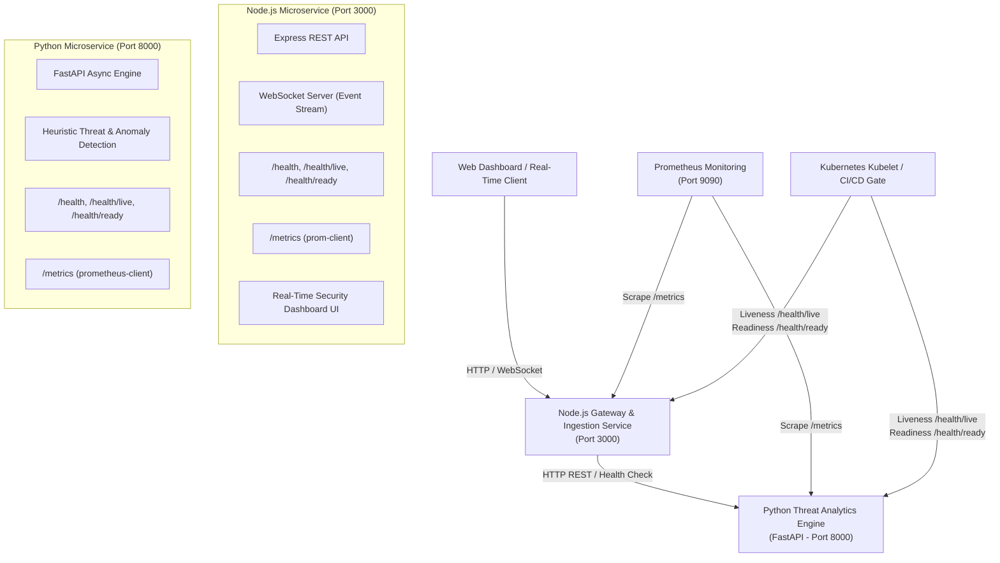

# 🛡️ AWS DevSecOps Real-Time Microservices Platform

[](.github/workflows/devsecops-ci.yml)
[](https://nodejs.org/)
[](https://fastapi.tiangolo.com/)
[](https://prometheus.io/)
[](k8s/)
[](docker-compose.yml)

A production-grade, real-time microservices application designed specifically for **DevSecOps** portfolios, **Kubernetes** deployments, and **CI/CD** security pipelines.

The platform processes real-time security events and transactions across a **Node.js Gateway / Ingestion Service** and an asynchronous **Python (FastAPI) Analytics & Threat Engine**, broadcasting live telemetry to connected web clients over **WebSockets**, while exposing enterprise-standard `/health` and `/metrics` (Prometheus) endpoints.

---

## 🏛️ Architecture Overview



---

## 🚀 Key Features

### 1. Node.js API Gateway & Real-Time Ingestion Microservice (`services/node-service`)
- **Real-Time WebSocket Streaming**: Broadcasts live analyzed events, threat alerts, and connection stats.
- **Microservice Orchestration**: Forwards payloads to downstream Python microservice with circuit-breaking fallback.
- **Embedded Dark-Mode Dashboard**: Interactive UI with event presets (SQLi, XSS, Brute Force, High-Value Transfers), JSON inspector, and live metrics.
- **Security Middleware**: Helmet security headers, CORS, and Express rate limiting.

### 2. Python Threat & Anomaly Analytics Microservice (`services/python-service`)
- **FastAPI Engine**: High-throughput asynchronous REST API with Pydantic v2 data validation.
- **Real-Time Threat Detection**: Identifies SQL Injection, Cross-Site Scripting (XSS), Path Traversal, Automated Scanners, and Financial Anomaly patterns.
- **Dynamic Risk Scoring**: Calculates risk scores (0–100) and provides automated remediation guidance.

### 3. Kubernetes & CI/CD Verification Endpoints
- **Detailed Aggregated Health (`GET /health`)**: Comprehensive diagnostics including uptime, memory RSS/heap, CPU usage, active WebSocket connections, and downstream dependency health checks.
- **Kubernetes Liveness Probe (`GET /health/live`)**: Ultra-fast check returning `200 OK` to ensure container processes are alive.
- **Kubernetes Readiness Probe (`GET /health/ready`)**: Verifies the microservice is prepared to route incoming traffic.
- **Prometheus Telemetry (`GET /metrics`)**: Scrape endpoints exposing standard runtime metrics + custom business metrics (request latency histograms, event counts, detected threat severities).

### 4. DevSecOps & Cloud-Native Hardening
- **Multi-Stage Dockerfiles**: Minimal Alpine / slim runtime images.
- **Non-Root Execution**: Runs under unprivileged users (`USER node` UID 1000 / `USER appuser` UID 10001).
- **Built-in Container `HEALTHCHECK`**: Automatically monitored by Docker and Kubernetes.
- **Kubernetes Pod Security Standard**: Hardened manifests with `readOnlyRootFilesystem: true`, `allowPrivilegeEscalation: false`, and `drop: [ALL]` capabilities.
- **CI/CD Pipeline**: GitHub Actions workflow covering SAST, SCA (`npm audit`, `pip-audit`), unit tests, Trivy image vulnerability scanning, and dynamic healthcheck verification gates.

---

## 📡 API Endpoints Reference

### Common DevSecOps Endpoints (Both Microservices)

| Method | Endpoint | Description | Typical Use Case |
|---|---|---|---|
| `GET` | `/health` | Full aggregated diagnostics & dependency status | CI/CD deployment verification & monitoring |
| `GET` | `/health/live` | Process liveness check (`200 OK`) | Kubernetes `livenessProbe` |
| `GET` | `/health/ready` | Service traffic readiness check | Kubernetes `readinessProbe` |
| `GET` | `/metrics` | Prometheus metrics scrape format | Observability & Grafana alerting |

### Node.js Gateway Endpoints (Port 3000)

| Method | Endpoint | Description |
|---|---|---|
| `GET` | `/` | Real-Time DevSecOps Operations Dashboard UI |
| `WS` | `/ws/events` | WebSocket live stream connection |
| `POST` | `/api/v1/events` | Ingest real-time telemetry event (analyzed & broadcasted) |
| `GET` | `/api/v1/events` | Retrieve recent event stream history |
| `GET` | `/api/v1/stats` | Summary statistics of processed events |

### Python Analytics Endpoints (Port 8000)

| Method | Endpoint | Description |
|---|---|---|
| `POST` | `/api/v1/analyze` | Analyze single security event and compute risk score |
| `POST` | `/api/v1/batch-analyze` | Batch analysis of multiple telemetry events |
| `GET` | `/docs` | Interactive OpenAPI / Swagger UI |

---

## 🛠️ Quick Start

### Prerequisites
- [Docker](https://docs.docker.com/get-docker/) & [Docker Compose](https://docs.docker.com/compose/)
- [Node.js 18+](https://nodejs.org/) and [Python 3.10+](https://www.python.org/) (for local dev)

### Option 1: Run with Docker Compose (Recommended)
Launch both microservices and Prometheus in isolated containers:
```bash
docker compose up --build -d
```
Access the services:
- **Operations Dashboard**: [http://localhost:3000](http://localhost:3000)
- **Node.js Health**: [http://localhost:3000/health](http://localhost:3000/health)
- **Node.js Prometheus Metrics**: [http://localhost:3000/metrics](http://localhost:3000/metrics)
- **Python FastAPI Docs**: [http://localhost:8000/docs](http://localhost:8000/docs)
- **Python Health**: [http://localhost:8000/health](http://localhost:8000/health)
- **Python Prometheus Metrics**: [http://localhost:8000/metrics](http://localhost:8000/metrics)
- **Prometheus UI**: [http://localhost:9090](http://localhost:9090)

To stop:
```bash
docker compose down
```

---

### Option 2: Run Locally for Development

#### 1. Start Python Analytics Microservice
```bash
cd services/python-service
python3 -m venv .venv
source .venv/bin/activate
pip install -r requirements.txt
uvicorn app.main:app --host 0.0.0.0 --port 8000 --reload
```

#### 2. Start Node.js Gateway Microservice
```bash
cd services/node-service
npm install
npm start
```
Open [http://localhost:3000](http://localhost:3000) in your browser.

---

## 🧪 Automated Testing

Run the automated test suites using the Makefile:
```bash
# Run all tests (Python Pytest + Node.js Jest)
make test

# Or run individually:
make test-python
make test-node
```

---

## ☸️ Kubernetes Deployment

Deploy the platform to a Kubernetes cluster (Minikube, EKS, K3s, Kind):

```bash
# Apply namespace, deployments, services, and ingress
kubectl apply -f k8s/namespace.yaml
kubectl apply -f k8s/python-service-deployment.yaml
kubectl apply -f k8s/node-service-deployment.yaml
kubectl apply -f k8s/ingress.yaml

# Check rollout status
kubectl get pods -n devsecops-platform
kubectl get svc -n devsecops-platform
```

---

## 📁 Repository Structure

```
aws-devsecops-platform/
├── .github/
│   └── workflows/
│       └── devsecops-ci.yml        # DevSecOps CI/CD security pipeline
├── docker-compose.yml              # Multi-container orchestration with Prometheus
├── Makefile                        # Build, test, and run automation helpers
├── prometheus/
│   └── prometheus.yml              # Scrape configuration for /metrics
├── k8s/                            # Production-ready Kubernetes manifests
│   ├── namespace.yaml
│   ├── node-service-deployment.yaml
│   ├── python-service-deployment.yaml
│   └── ingress.yaml
├── services/
│   ├── node-service/               # Node.js Gateway & Ingestion Microservice
│   │   ├── Dockerfile              # Multi-stage secure build (USER node)
│   │   ├── package.json
│   │   ├── public/                 # Real-Time DevSecOps Dashboard UI
│   │   │   ├── index.html
│   │   │   ├── style.css
│   │   │   └── app.js
│   │   ├── src/
│   │   │   ├── app.js
│   │   │   ├── config.js
│   │   │   ├── index.js
│   │   │   ├── routes/             # /health, /metrics, /api/v1/events
│   │   │   ├── services/           # WebSocket server & Python client
│   │   │   └── utils/              # Winston logger & Prometheus metrics
│   │   └── tests/                  # Jest unit & integration tests
│   └── python-service/             # Python Analytics Microservice
│       ├── Dockerfile              # Multi-stage secure build (USER appuser)
│       ├── requirements.txt
│       ├── app/
│       │   ├── config.py
│       │   ├── main.py
│       │   ├── models/             # Pydantic schemas
│       │   ├── routes/             # /health, /metrics, /api/v1/analyze
│       │   ├── services/           # Real-time threat detection engine
│       │   └── utils/              # Structured logger & Prometheus metrics
│       └── tests/                  # Pytest test suite
└── README.md
```

---

## 🔒 Security Best Practices Implemented

- **Non-Root Containers**: Ensures containers cannot escalate privileges on host nodes.
- **Minimal Attack Surface**: Uses Alpine / Slim base images with zero unnecessary binaries.
- **Resource Constraints**: Explicit CPU and Memory requests and limits preventing noisy-neighbor DoS.
- **Container Health Probes**: Zero-downtime rolling deployments via Kubernetes Liveness and Readiness probes.
- **Telemetry & Observability**: Real-time Prometheus metrics for instant alert triggering.
- **SAST & SCA Scanning**: Integrated Trivy, npm audit, and pip-audit pipeline stages.
